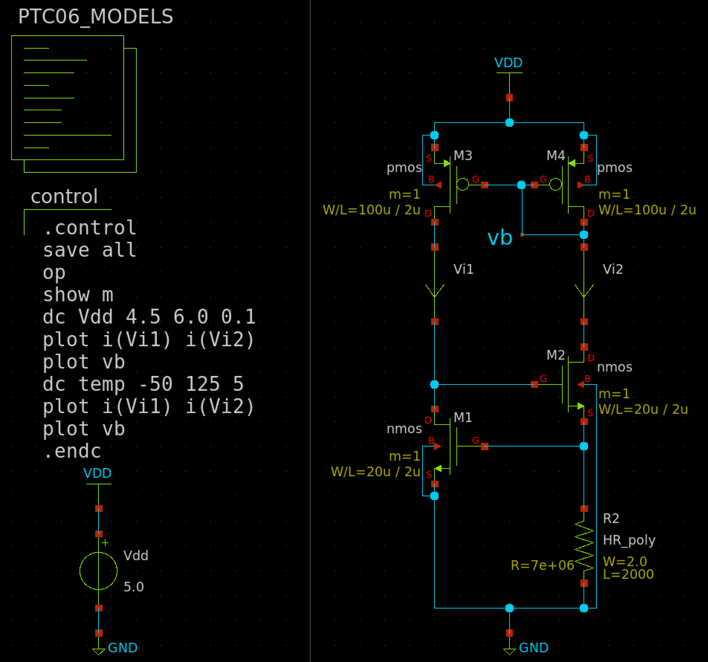
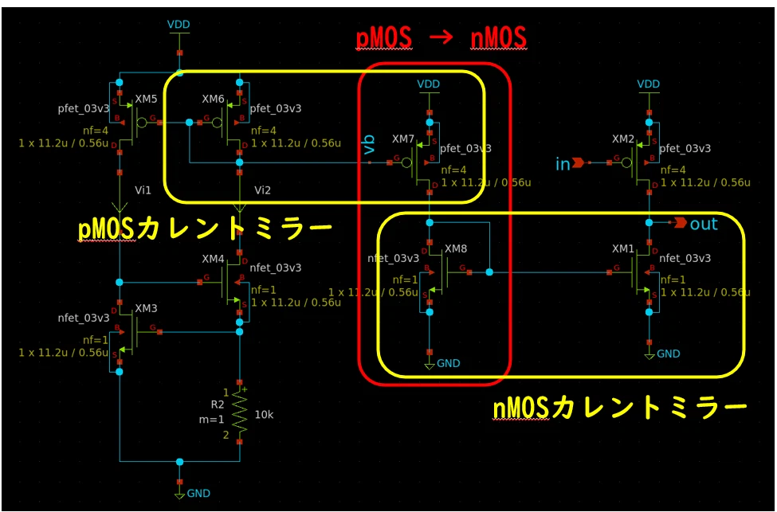
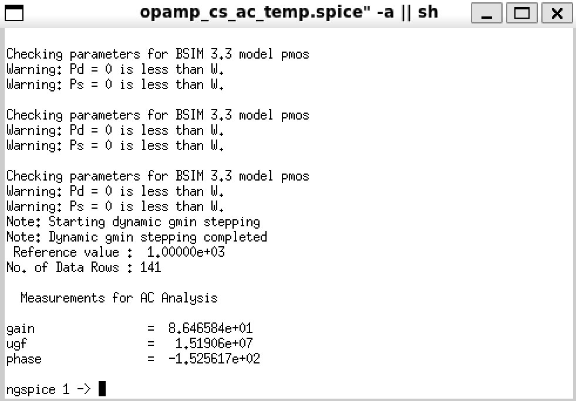

#オペアンプと電流源設計してみよう
[OpenRule1um PDK](https://github.com/ishi-kai/OpenRule1umPDK_setupEDA)の[PTC06 PDK](https://github.com/ishi-kai/OpenRule1umPDK_setupEDA?tab=readme-ov-file#%E3%83%95%E3%82%A7%E3%83%8B%E3%83%86%E3%83%83%E3%82%AF%E3%82%B7%E3%83%A3%E3%83%88%E3%83%ABpdk%E3%81%AE%E5%A0%B4%E5%90%88)向けに設計されています。

# 共通
## トランジスタの素性を調べる
回路を作る前にトランジスタの素性を知っておく必要があります。アナログ回路設計で重要なのはドレイン電流 Id、しきい値電圧 Vth、相互コンダクタンス gm、出力抵抗 rds (1/gds)。まずはチャネル長 L を最小の 1 um、MOSのサイズはきりのいいところで W/L=10 にしておきましょう。  

しきい値電圧はだいたい 0.8 V前後、ということはこのトランジスタのゲート-ソース間電圧はオーバードライブ100 mV ぐらいとして 0.9 Vぐらいが最も電流効率 (gm/Id) がよくなります。下図のように，オーバードライブはかけすぎると電流が大きくなる割に gm はそれほど増えないので効率が悪くなります。

ということで Vgs は 0.8 V，Vds は電源電圧の半分 (2.5 V) として特性を調べると下のような値になります．

- Id/Vgs出力用シミュレーションファイル
    - [nMOS用](./opamp/pfet_idvgs.sch)
    - [pMOS用](./opamp/pfet_idvgs.sch)
- Id/Vds出力用シミュレーションファイル
    - [nMOS用](./opamp/pfet_idvds.sch)
    - [pMOS用](./opamp/pfet_idvds.sch)

| L=1μm | nMOS | pMOS |
|:------------:|:--------------:|:------------|
| Vth | 836mV | 1.3V |
| Id | 5.2uA | 1.8uA |
| gm | 67.4uS | 17.8uS |
| rds | 4.8MΩ | 13.0MΩ |
| gm*rds(Intrinsic gain) | 323.52 | 231.4 |

しきい値電圧の違いもありますが、nMOS と pMOS でかなり特性が違います。nMOS は Intrinsic gain (gm*rds)が323.52 (50 dB)で十分に見えます。直流利得は pMOS で稼ぐのがよさそうな雰囲気がします。ちょっと、pMOSのほうがIntrinsic gainが低いのが気になるので、L を2倍 (2 um) にした場合も見ておきましょう。W/L は同じ 10 になるように，W=20 umです。

ということで Vgs は 0.8 V，Vds は電源電圧の半分 (2.5 V) として特性を調べると下のような値になります．

- Id/Vds出力用シミュレーションファイル
    - [nMOS用](./opamp/pfet_idvds_2L.sch)
    - [pMOS用](./opamp/pfet_idvds_2L.sch)

| L=2μm | nMOS | pMOS |
|:------------:|:--------------:|:------------|
| Vth | 786mV | 1.4V |
| Id | 8.6uA | 0.78uA |
| gm | 96.4uS | 8.3uS |
| rds | 4.8MΩ | 55.0MΩ |
| gm*rds(Intrinsic gain) | 462.72 | 456.5 |

まだ、微妙なところではありますが、これ以上Lを大きくするとMOSのサイズが大きくなりすぎてしまうので、L=2μmを利用することにします。  
また、利得を稼ぎたいときは L を大きくすればよさそうということが分かります。  

# オペアンプ
## 全体の構成と設計目標
ここでは最も基本的な2段オペアンプを作ります。差動入力段 (初段) と増幅段 (2段目)、それに位相補償をかけます。  
初段は rds が高く電流効率 (gm/Id) もよい pMOS、を使うことにします。そうすると差動段のテール電流源 (M5) は pMOSになるので、各段に電流を供給するカレントミラーは pMOS で構成することになります (M5, M6, M8, M9)。  
ということで2段目はpMOSカレントミラーを負荷とする nMOS ソース接地増幅回路になります。回路図は下図です。差動増幅 (M1～M5)、ソース接地 (M6，M7) 以外にもいろいろトランジスタが使われていますが、これらは順を追って説明します。  
Vinp，Vinn が差動入力、Vout が出力電圧です。バイアス電流として Ibias を使っています。負荷容量は CL です。

## 差動増幅段

# 電流源
トランジスタはそもそも電流源です。BJTであればベース電流で制御される電流制御電流源、MOSFET であればゲート-ソース間電圧で制御される電圧制御電流源と見なすことができます。ということは制御電流/制御電圧を一定にすればトランジスタは定電流源になるはず。その制御電圧を生成して電流をコピーするのがおなじみカレントミラーです。  
しかし、OR1にはBJTはありません。BJTなしの定電流源を作ります。  

## 基本電流源
電流を作るもっとも安直な方法は抵抗を使うことです。

- [基本電流源回路](./current-source/cs-basic.sch)

オペアンプの設計に合わせて、チャネル長 L を最小の2倍にしています。適当に W/L = 10 にして抵抗を調整し、参照電流 (i1) が 5 mA ぐらいになるようにしました。

また、抵抗で参照電流を作っているため電源電圧を±10% 変えると参照電流もほぼ±10%変動しています。また、温度特性を見ると

-50℃～125℃でだいたい半分ぐらい変わっています。

## Vth-referenced 自己バイアス電流源
電圧に依存しない電流を作る方法として、Vth-referenced 自己バイアス回路というものがあります。

- [Vth-referenced 自己バイアス回路](./current-source/cs-vth-ref.sch)

M1 と M2 のつなぎ方がカレントミラーと異なっているところがポイントです。この構成にすると、M1・M2 に流れるドレイン電流がトランジスタのしきい値電圧によって ≃ Vth/R となります。  
また、ここでは、MOSFETのサイズをW=100μm L=2μmとしています。理由は、先ほど設計したオペアンプで利用する電流源＝10μAを供給する電流源とするためです。50μAを流す電流源として、設計して、カレントミラーで電流をミラーするときに、オペアンプ側のpMOSがW=20μmなので、1/5となり、10μAとなるという寸法です。  
シミュレーションすると、

i2 は電源電圧に対して安定しており、変動は0.5%以下になっています。一方、Vth を参照しているため温度による Vth の変動はそのまま出力に影響します。温度変動に対しては電流は約10%変動します。

# オペアンプ＋電流源
## 電流源の使い方
前節までで電流源回路ができたわけですが、これどうやって使うの？ と思う人も多いのではないかと思います。それもそのはずで、電流源回路、ある意味で名前に偽りがあります。その辺を説明します。

### 電流源回路と電流源記号
回路素子で電流源と言えば下の記号

端子があって、端子から流れ出る/流れ込む電流が一定となる素子です。ところが前節の回路はどれも、回路の内部に一定の電流が流れてはいますが、その電流が端子から外部に出入りすることはありません。つまりここで紹介した電流源回路は、回路記号の電流源に相当するものではないのです。というわけで、区別を明確にするためにここでは前節で紹介した回路を「電流源回路」、回路記号の電流源を単に「電流源」と書くことにします。上に書いた通り、「電流源」は2つの端子を持ち、端子に流れる電流が一定となる素子です。  

では「電流源回路」の出力端子は何なのかというと、電流源回路が他の回路とやりとりするのは電流ではなくカレントミラーのバイアス電圧です。つまり、電流源回路は「設定した電流を端子から出力する」のではなく、「カレントミラーに設定通りの電流が流れるようなバイアス電圧を出力する」回路ということです。言い換えると、電流源回路は電流源記号を置き換えるのではなくカレントミラーの参照電流側を置き換えるものです。下図参照。  

### つなぎ方の例
具体的に使い方の例を示します。下図のように、アクティブ負荷を持つソース接地増幅回路があったとします。この回路は設計段階では理想電流源を使ってカレントミラーでアクティブ負荷を作ってシミュレーションしました。これを電流源回路と結合します。

つなげる前にこの回路をもう一度よく見ておくと、増幅回路として必要なのは XM1 と XM2 だけです。XM2 をアクティブロード (電流源) にしたいので、XM3 をつけてカレントミラーを組み、XM2 のゲート電位を固定します (黄色の枠線)。XM3 はバイアス電圧を作るわけですが、そのためには基準電流が必要なので、ここでは理想電流源を使って参照電流を流し、それによってバイアスを定めます (赤の枠線)。ようするに、この回路が増幅回路としてうまく機能するのに必要なのは「XM2 のゲート電圧を決めてくれる誰か」なわけです。

というわけで、電流源回路をつなぎます。前節で紹介した Vth-reference型をつなげると、下図になります。

電流源回路とソース接地増幅回路をつなぐのは、電流ではなくバイアス電圧 Vb です。参照電流を流している XM6 とアクティブ負荷 XM2 がカレントミラーになっているので、(MOSサイズを適切に調整していれば) これで理想電流源を使った回路と同じものになるというわけです。

なお nMOS カレントミラーでバイアス電流を流したいんだけど… という場合に XM3 や XM4 のゲート電圧を使ってはいけません。これらのゲートと別の nMOS のゲートをつないでもカレントミラーにはなりません。カレントミラーの参照側は XM6 のようにダイオード接続 (ゲートとドレイン直結) である必要があります。そのため、nMOS カレントミラーを動かしたい場合は下図のようになります。

まず pMOSカレントミラーで XM7 を電流源として動かし、その電流を ダイオード接続された XM8 に流すことで nMOSゲート電圧を作っています。あとはその電圧を XM1 に渡せば、XM1 が電流源としてはたらくという仕組みです。

## オペアンプに電流源を接続する
前節の内容に従って、電流源をオペアンプに接続して、各種性能評価をします。

- [オペアンプ＋電流源回路](./opamp/opamp_cs.sch)

### オープンループ特性

### CMRR

### 温度解析

問題はないようなので、これで完成です。

# 出典
土谷先生のGF180による[OPAMPサンプル](https://note.com/akira_tsuchiya/n/n710ed2d0e428)と[CSサンプル](https://note.com/akira_tsuchiya/n/n307d76106a86)_を[OpenRule1um PDK](https://github.com/ishi-kai/OpenRule1umPDK_setupEDA)の[PTC06 PDK](https://github.com/ishi-kai/OpenRule1umPDK_setupEDA?tab=readme-ov-file#%E3%83%95%E3%82%A7%E3%83%8B%E3%83%86%E3%83%83%E3%82%AF%E3%82%B7%E3%83%A3%E3%83%88%E3%83%ABpdk%E3%81%AE%E5%A0%B4%E5%90%88)向けに書き直したものです。

## ライセンス
SPDX-License-Identifier: Apache-2.0 

Copyright 2024 Noritsuna IMAMURA
Copyright 2023 Akira Tsuchiya (atuchiya)
