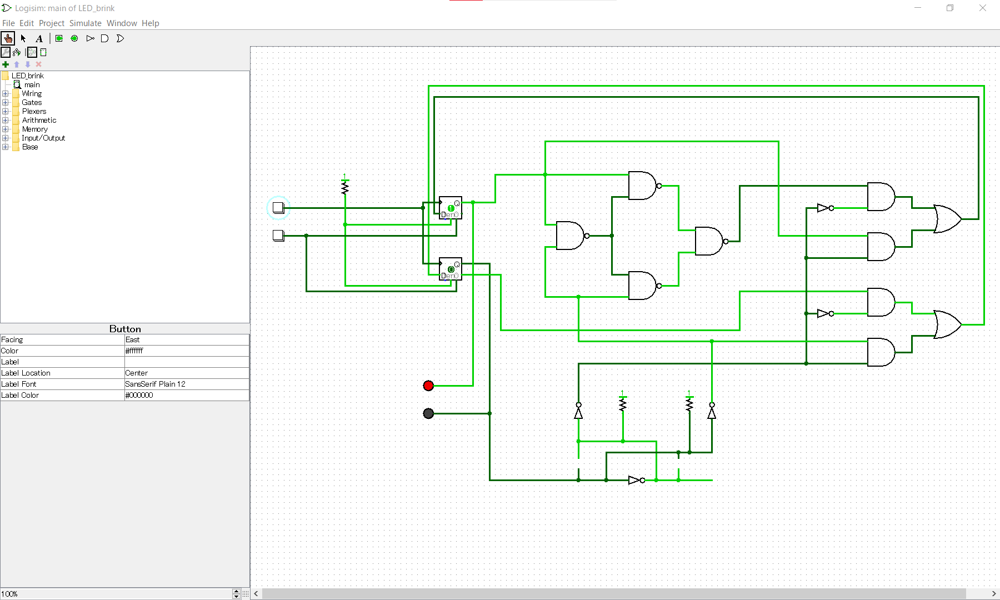

# 1bit-CPU設計
[OpenSUSI-TR10 PDK](https://github.com/ishi-kai/OpenEDA-PDK_SetupScript)の[OpenSUSI-TR10 PDK](https://github.com/ishi-kai/OpenEDA-PDK_SetupScript#in-the-case-of-the-opensusi-for-tokai-rika-shuttle-pdk)向けに設計されています。

## ドキュメント
ロジック回路（デジタル回路）の設計手法の一つを解説した資料です。  
HDLやロジック回路（デジタル回路）がどのようにGDSに変換されているのかの学習が目的のハンズオンです。  
- [OpenSUSI-TR10版1bit-CPU回路図](./1bit-CPU.sch)
- [OpenSUSI-TR10版1bit-CPU回路図の１ライン版](./1bit-CPU_1line.sch)
- [OpenSUSI-TR10版1bit-CPUテストベンチ](./1bit-CPU_1line_tb.sch)
- [OpenSUSI-TR10版1bit-CPUレイアウト](./1bit-CPU_1line.gds)

## シミュレーション
シミュレーションには[logicsim](http://www.cburch.com/logisim/)を利用しています。  

 

- [シミュレーションファイルのディレクトリ](logicsim)

## 詳細解説資料
上記の設計を詳細に解説した資料です。  
- [OpenSUSI-TR10版1bit-CPU解説書:PDF版](/OpenSUSI-TR10/docs/1bit-CPU_OpenSUSI-TR10.pdf)
- [OpenSUSI-TR10版1bit-CPU解説書:PPTX版](/OpenSUSI-TR10/docs/1bit-CPU_OpenSUSI-TR10.pptx)
    - SPDX-License-Identifier: Apache-2.0  

## 開発環境のセットアップ
本ハンズオンを実施するには、EDAとOpenSUSI-TR10 PDKのセットアップをしてください。  
他のPDKがインストール済み場合は、「bash unisntall.sh」を実施してからセットアップしてください。  

- [セットアップツール](https://github.com/ishi-kai/OpenEDA-PDK_SetupScript)

## オプション
### 最小構成
- [1bit-CPUの最小構成の回路図](./1bit-CPU_1line_min.sch)
- [1bit-CPUの最小構成のレイアウト](./1bit-CPU_1line_min.gds)

### LVS OK
ファイル名に「-」や「_」などがあるとLVSが通らない問題があるため、削除したバージョン。  

- [OpenSUSI-TR10版1bit-CPU回路図](./1bitCPU.sch)
- [OpenSUSI-TR10版1bit-CPUレイアウト](./1bitCPU.gds)
