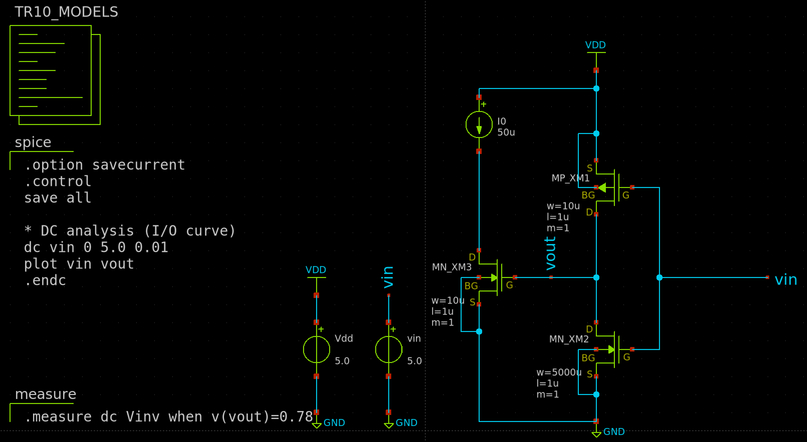

# 電流源を設計してみよう
[OpenSUSI-TR10 PDK](https://github.com/ishi-kai/OpenEDA-PDK_SetupScript)の[OpenSUSI-TR10 PDK](https://github.com/ishi-kai/OpenEDA-PDK_SetupScript#in-the-case-of-the-opensusi-for-tokai-rika-shuttle-pdk)向けに設計されています。

## ドキュメント
電流源の設計手法の一つを解説した資料です。  
アナログ回路の基礎の学習が目的のハンズオンです。  

- [OpenSUSI-TR10版電流源解説書:PDF版](/OpenSUSI-TR10/docs/CS_OpenSUSI-TR10.pdf)
- [OpenSUSI-TR10版電流源解説書:PPTX版](/OpenSUSI-TR10/docs/CS_OpenSUSI-TR10.pptx)
    - SPDX-License-Identifier: Apache-2.0  

# ライセンス
SPDX-License-Identifier: Apache-2.0  

- Copyright 2026 Noritsuna IMAMURA (noritsuna)
