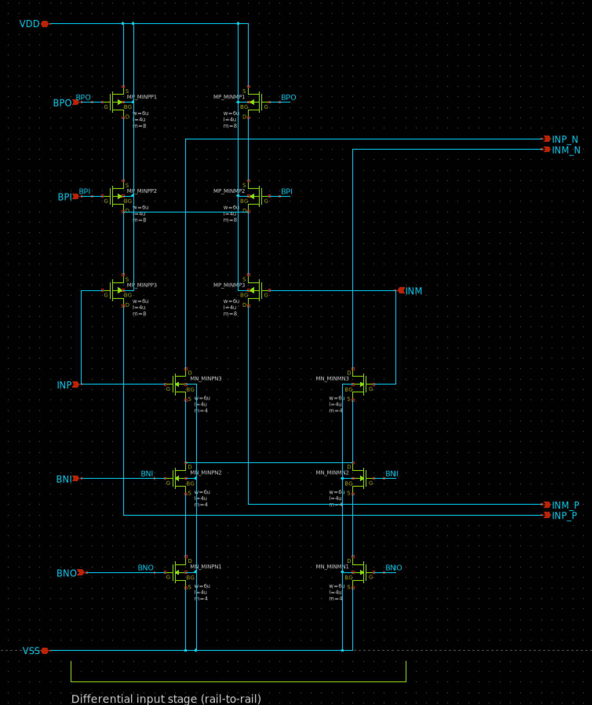
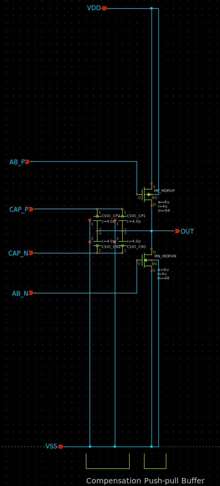
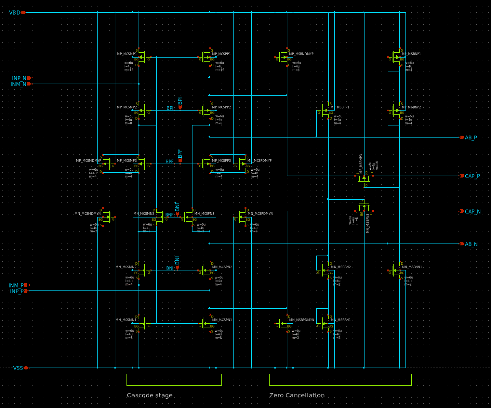
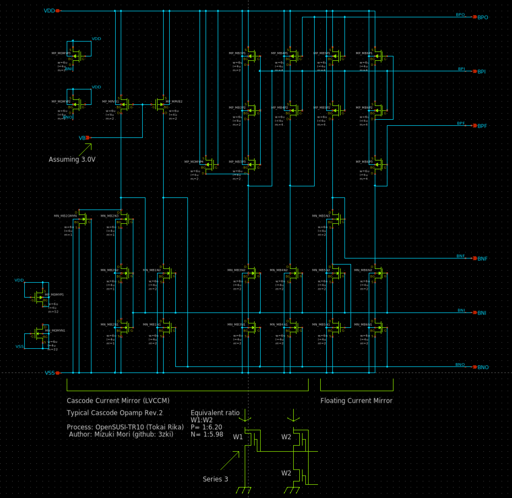
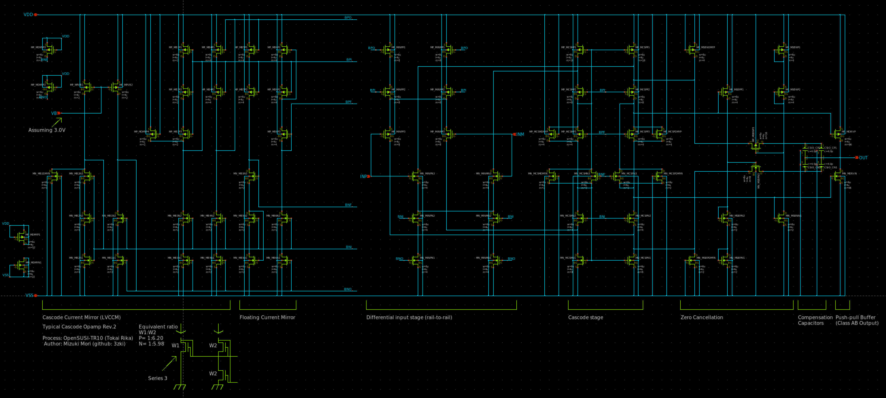

# オーディオ用OPAMP設計ハンズオン
[OpenSUSI-TR10 PDK](https://github.com/ishi-kai/OpenEDA-PDK_SetupScript)の[OpenSUSI-TR10 PDK](https://github.com/ishi-kai/OpenEDA-PDK_SetupScript#in-the-case-of-the-opensusi-for-tokai-rika-shuttle-pdk)向けに設計されています。

## ドキュメント
オーディオ用OPAMPの音質に関する部分だけを設計して、レイアウトするハンズオンとなります。  
具体的には、Rail-to-Railな二段差動増幅OPAMP部分と最終段のAB級アンプ部分のみを作ってみようというハンズオンとなります。  
その他の部分は、こちらで用意したものを利用してもらいます。  

- [OpenSUSI-TR10版オーディオ用OPAMP解説書:PDF版](/OpenSUSI-TR10/docs/OPAMP_R2R_Audio_OpenSUSI-TR10.pdf)
- [OpenSUSI-TR10版オーディオ用OPAMP解説書:PPTX版](/OpenSUSI-TR10/docs/OPAMP_R2R_Audio_OpenSUSI-TR10.pptx)
    - SPDX-License-Identifier: Apache-2.0  

# ライセンス
SPDX-License-Identifier: Apache-2.0  

- Copyright 2026 Mizuki Mori (3zki)
- Copyright 2026 Noritsuna IMAMURA (noritsuna)
