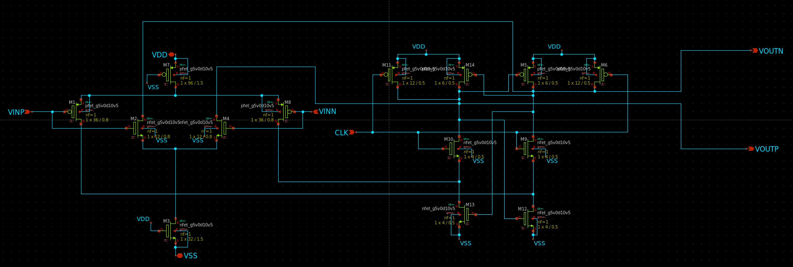
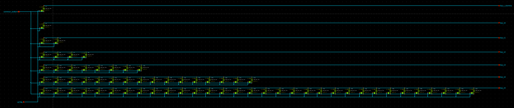
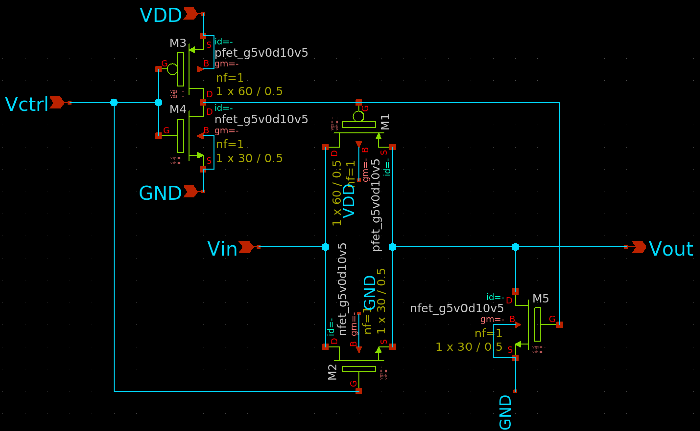
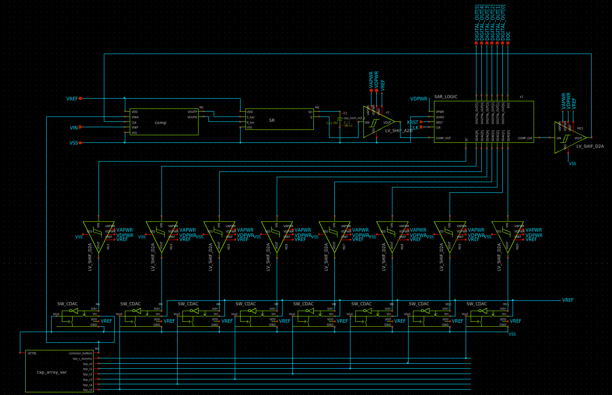
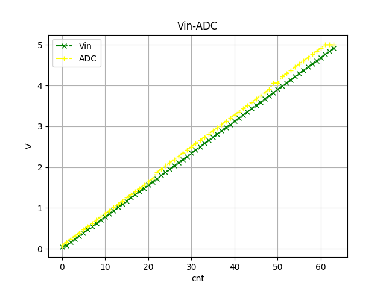
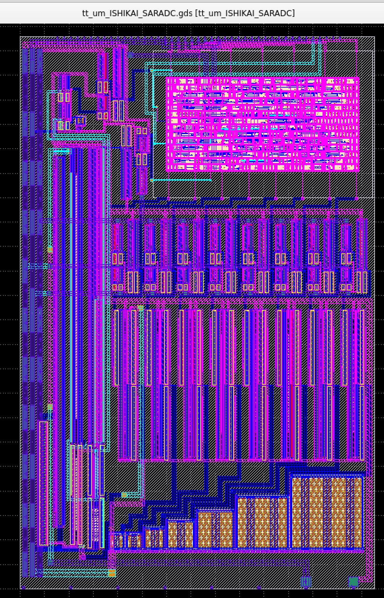

# SAR-ADCを設計してみよう
[TinyTapeout](https://tinytapeout.com/)の[Sky130 PDK](https://github.com/ishi-kai/OpenEDA-PDK_SetupScript)向けに設計されています。  
[Chipathon2023向けに作ったSAR-ADC](https://github.com/ishi-kai/Chipathon2023_ADC)をベースに設計されています。  

## ドキュメント
SAR-ADCの設計手法の一つを解説した資料です。  
デジタル回路とアナログ回路の混載回路を学習することが目的のハンズオンです。  

- [Sky130版SAR-ADC解説書:PDF版](/SKY130/docs/SAR-ADC_SKY130.pdf)
- [Sky130版SAR-ADC解説書:PPTX版](/SKY130/docs/SAR-ADC_SKY130.pptx)
    - SPDX-License-Identifier: Apache-2.0  

    - [CSVデータ](./images/tran_sar_adc_vin_vout_result.csv)

### サンプルレイアウト
わざとバラツキが最大になるようにレイアウトしたサンプルです。  
実際にTinyTapeout(sky130)で製造して、どのくらいばらつくのかを測定予定です。  
チャレンジする方は、これに対してどのくらいばらつきなくレイアウトできるか、チャレンジしてみてください。  

- [TinyTapeoutに投稿したリポジトリ](https://github.com/ishi-kai/ttsky26c-tt_um_ISHIKAI_SARADC/)

### 各種バージョン
- [1.8Vのみ対応SAR-ADC](./SAR-ADC_1.8V/)
- [1.8-5.0V可変対応SAR-ADC](./SAR-ADC_5.0V/)

# ライセンス
SPDX-License-Identifier: Apache-2.0  

- Copyright 2023 Chipathon2023 SAR-ADC Team
- Copyright 2026 Noritsuna IMAMURA (noritsuna)
