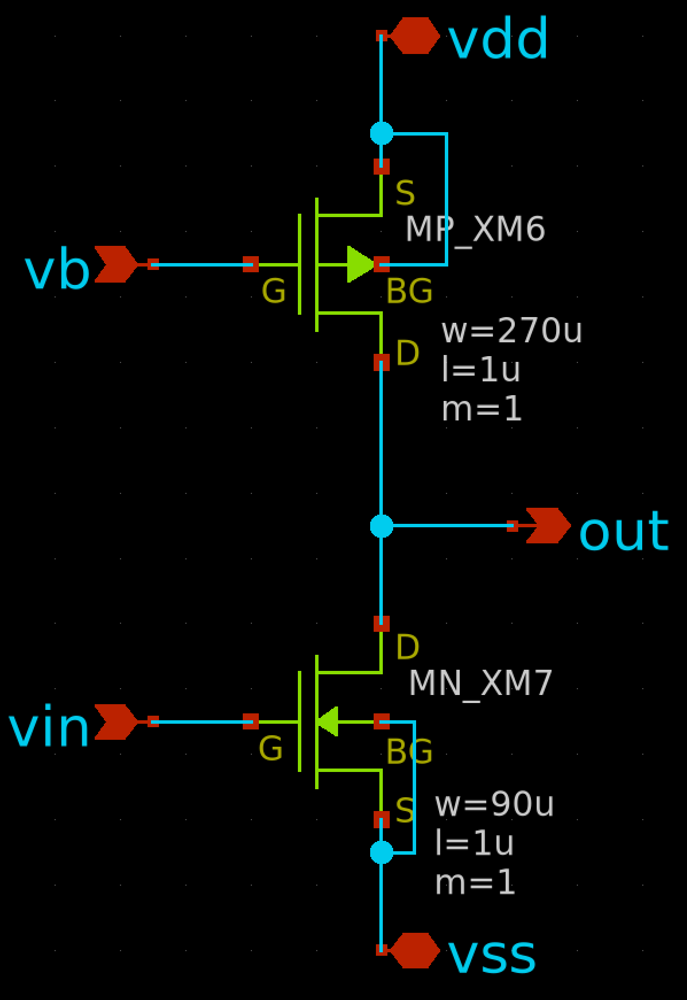
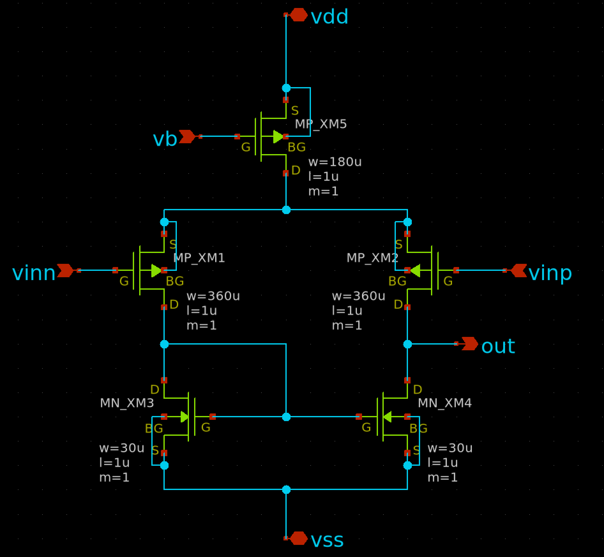
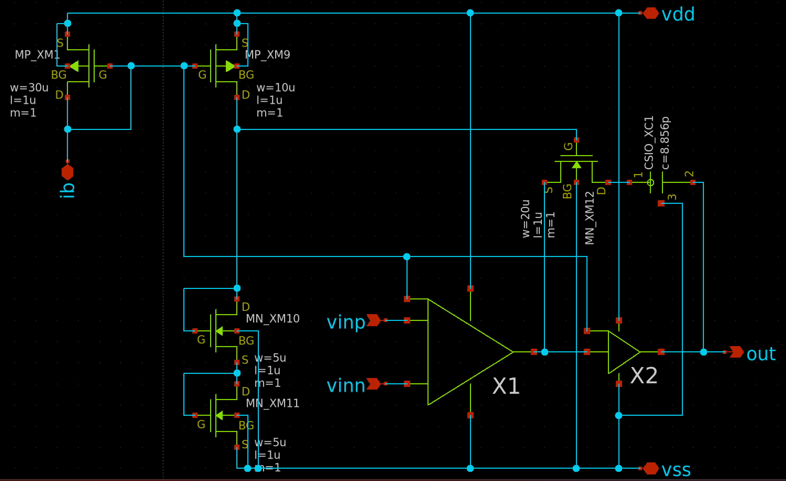
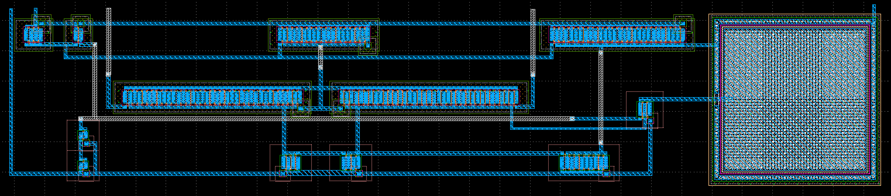

# オペアンプを設計してみよう
[TR10（東海理化シャトル） PDK](https://github.com/ishi-kai/OpenEDA-PDK_SetupScript)の[TR10（東海理化シャトル）PDK](https://github.com/ishi-kai/OpenEDA-PDK_SetupScript#in-the-case-of-the-tokai-rika-shuttle-pdk)向けに設計されています。

## ドキュメント
OPAMPの設計手法の一つを解説した資料です。  
アナログ回路の基礎の学習が目的のハンズオンです。  
[OR1版](/OR1/PTC06/)はまた違った手法で設計・解説しています。気になる方はそちらも参考にしてください。  
また、理解に必要な基礎知識一覧は、「[LSI設計者のためのCMOSアナログ回路入門』を読む前に必要な数学チートシート（生成AI質問用）](https://zenn.dev/qwerewq/articles/ffcd84ffa97e18)」をご覧ください。  

- [TR10版OPAMP解説書:PDF版](/TR10/docs/OPAMP_TR10.pdf)
- [TR10版OPAMP解説書:PPTX版](/TR10/docs/OPAMP_TR10.pptx)
    - SPDX-License-Identifier: Apache-2.0  

## 初めてのOPAMP設計講座
[滋賀県立大学の土谷先生](https://db.spins.usp.ac.jp/html/200000364_ja.html)に初めての方を対象としたOPAMP回路がどのような構造になっているのか？それらの特徴や設計のポイントなど解説した講座を開催しました  
実施していただいた「初めてのOPAMP設計講座」の内容は、下記にアーカイブがありますので、初めての方は、まず、こちらのビデオや資料を見ていただくと良いかと思います。  

- [講座の各種リンク](/docs/README.md)

## 各種公式やパラメータ一覧表
- 
- 
- 
- 

# ライセンス
SPDX-License-Identifier: Apache-2.0  

- Copyright 2023 Akira Tsuchiya (atuchiya)
- Copyright 2024 Noritsuna IMAMURA (noritsuna)
